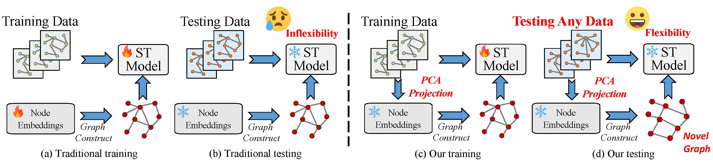

# PCA-Embedding for Traffic Forecasting

This repository contains the implementation of "Unveiling the Inflexibility of Adaptive Embedding in Traffic Forecasting", which proposes a novel PCA-embedding approach to address spatiotemporal distribution shifts in traffic prediction models.

## Overview

Traditional traffic forecasting models often struggle with evolving urban environments and changing traffic patterns. This project introduces PCA-embedding as a solution to three key challenges:

1. **Limited Inductive Capacity**: Enabling models to adapt to new scenarios without retraining
2. **Excessive Spatial Distinguishability**: Balancing spatial representation without overfitting
3. **Poor Transferability**: Allowing seamless application across different deployments




## Datasets

We evaluate our approach on multiple datasets:

### PEMS Datasets
- PEMS03 (358 nodes)
- PEMS04 (307 nodes)
- PEMS07 (883 nodes)
- PEMS08 (170 nodes)


## Requirements

```bash
pytorch>=1.12.0
numpy
pandas
scikit-learn
```

## Installation

```bash
git clone https://github.com/Dreamzz5/PCA-Embedding.git
cd PCA-Embedding
pip install -r requirements.txt
```

## Usage

### Data Preparation

1. Download the Cross-year PEMS datasets:
   - [Download Link](https://drive.google.com/file/d/1NWNTivV6kJ3JsttuOAFr0LjtzngHmPqF/view?usp=drive_link)

2. Extract and organize the data:
```bash
mkdir -p data
unzip data.zip -d data/


## Citation

If you find this work useful in your research, please cite our paper:

```bibtex
@article{wang2024unveiling,
  title={Unveiling the Inflexibility of Adaptive Embedding in Traffic Forecasting},
  author={Wang, Hongjun and Chen, Jiyuan and Zhang, Lingyu and Jiang, Renhe and and Song, Xuan},
  journal={arXiv preprint arXiv:submit/6006891},
  year={2024}
}
```

## License

This project is licensed under the MIT License - see the [LICENSE](LICENSE) file for details.

## Acknowledgements

- LargeST benchmark dataset
- California Department of Transportation (CalTrans)
- Performance Measurement System (PEMS)
